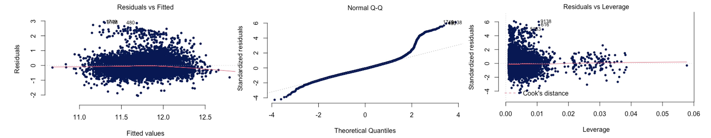
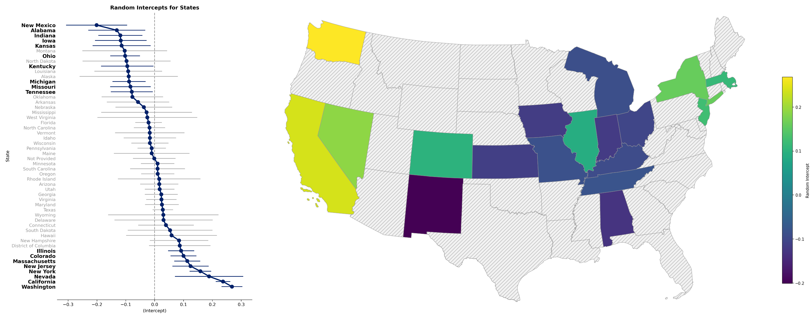

```{r setup, include=FALSE}
knitr::opts_chunk$set(
	echo = FALSE,
	message = FALSE,
	warning = FALSE
)

library(ggplot2)
library(readr)
library(GGally)
library(texreg)
library(xtable)
library(knitr)
library(kableExtra)
```

# Summary
\vspace{-10pt}
While many organizations in the United States have actively implemented diversity, equity, and inclusion (DEI) programs in the past decade thanks to the spotlight that several social movements, such as #metoo and Black Lives Matter, have shone on the embedded injustices in modern America, the programs' effects appear to not always penetrate through to leadership positions of these organizations. In this report, we leverage results from the 2021 Stack Overflow Annual Developer Survey and use a hierarchical linear regression model to investigate primarily how different demographic variables amongst other characteristics are associated with receiving higher compensation in the U.S. technological sector. The response variable in the study is `ConvertedCompYearly`, which is the annual compensation of each surveyed observation. Findings suggest that gender, ethnicity, age, education level, work experience, company size, job type, and how one learned to code all have a significant effect on compensation. Finally, the analysis concludes that location (the state in which the survey participant resides) is also significant in determining compensation. Those in the west coast (California - the home of Silicon Valley, or Washington - headquarters of Amazon) earn more than less technologically-focused states like the mid-West.

\vspace{-12pt}
# Introduction
\vspace{-10pt}
Diversity, equity, and inclusion efforts have gained traction within the last decade, but the results of such efforts are not always reflected in or visible from leadership, or high-earning, roles of Corporate America. Unfortunately, personnel data are well guarded secrets of each company, so such information can be challenging to obtain for analysis. Stack Overflow is by far the most widely-used, community-based platforms where the software programmers from around the world post their coding questions and answers with over 16 million registered users in 2021 (Stack exchange 2021). Each year, Stack Overflow surveys anonymously its users to improve the community and platform and in turn provides valuable insights into the technology sector. In this report, we intend to leverage the self-reported survey responses in 2021 to identify which factors are associated with receiving higher compensation in the technology sector of the United States in an attempt to shed light on whether demographic characteristics, such as ethnicity and gender, influence one's earnings.

\vspace{-12pt}
# Data
\vspace{-10pt}
## Data Preprocessing
\vspace{-8pt}
The original survey includes 39 questions (converting into 48 variables in the raw survey data) covering six main areas: basic information, experience, technology used, Stack Overflow Usage, demographic information and questions on the survey itself. The 2021 survey recorded 83,439 user responses from all around the world. To begin, we import data only from areas of interest: basic information, demographics and experience. Next, we filter for only those who selected *I am a developer by profession*, *Employed full-time*, and lives in the United States to focus on those who are employed in the United States, leaving us a base data set of 9,664 observations and 19 variables.

\vspace{-10pt}
### Response Variable
\vspace{-8pt}

Thereafter, we examine the four variables related to compensation in our data set: `Currency`, `CompTotal`, `CompFreq`, and `ConvertedCompYearly`. We determine that while the first three variables are survey responses, `ConvertedCompYearly` is calculated by Stack Overflow using a 2021 `Currency` conversion rate to USD $\times$ `CompTotal` $\times$ `CompFreq`. According to a collection of recruitment and employment resources, such as `Salary.com` and `Indeed.com`, we consolidate a conservative range of reasonable 2021 technology sector salaries of \$36-353K (Salary.com 2021). However, looking at our distribution of annual compensation (left figure below), we can observe unreasonably low and high salaries in both tails, which is likely due to erroneous user input, such as selecting UGX (Ugandan Shillings) as the currency instead of USD since UGX is listed just above USD in the drop-down menu. After correcting for clear erroneous cases, we examine observations in the bottom 0.25 percentile of earnings, which translate to 21 people earning less than \$14,382 a year. We determine this to be unreasonable for full-time employed developers, as any full-time workers earning minimum wage would make \$15,080 a year ($\$7.25 \times 40hrs \times 52wks$). Since there was no observable pattern or a reasonable correction, we drop them from the data set as user input errors. Further we address the thin right tail by closely examining the top 2.5 percentile of earners: those who reported annual earnings of \$1,560,000 ($\approx$ 4.5$\times$ the upper bound of the industry salary range) to \$21,822,250 (equivalent to estimated executive-level managers salaries at Apple). We find that everyone in this right tail had selected *Monthly* or *Weekly* for `CompFreq`, so we assume that they had misinterpreted the `CompTotal` question and inputted their total yearly salary instead of per period pay. Thus, we adjust `ConvertedCompYearly` accordingly (middle figure below). Finally, since the distribution of compensation is still left skewed, which might lead to assumption violations when fitting linear models, so we consider log transforming the final response variable: `ConvertedCompYearly`.

```{r, out.width="32%", fig.align='center', fig.show='hold'}
knitr::include_graphics(c("../20_intermediate_files/plots/comp_hist_raw.png","../20_intermediate_files/plots/comp_hist_clean.png", "../20_intermediate_files/plots/comp_hist_log.png"))
``` 

\vspace{-10pt}
### Predictor Variables
\vspace{-8pt}

Finally, we proceed to address any issues with our 16 predictor variables. Due to the nature of the survey, we have a multitude of factor variables. We begin by removing highly correlated variables (i.e. selecting `YearsCodePro` over `YearsCode`) and then converting the lower and upper bound of describing *less than 1 year* and *greater than X years* into lower and upper bound numerical values to create `YearsCodeProNum` in order to analysis as a continuous variable. Next, we collapse thin levels of single-select multiple choice questions into less levels (e.g. *Under 18 years old* and *18-24 years old* to form *Under 24 years old*. Lastly, we address multi-select multiple choice questions by either collapsing the multiple selections into single factor variables (`Gender`, `Sexuality`, `Ethnicity`, `Accessibility`, and `MentalHealth`) or breaking them out into multiple binary variables (`DevType`, `LearnCode`) depending on the nature of the variable. For instance, for `Ethnicity`, we collapsed those who selected one or more options as *Bi/Multi-racial* and any one who selected *Hispanic or Latino/a/x* to be just *Hispanic or Latino/a/x*. For `DevType` and `LearnCode`, we consolidate the factors into broader categories (e.g. *Developers - front-end*, *- back-end*, *- full-stack*, etc. are all categorized as *Software Development*), then anyone who selected any option in a category would be marked as *TRUE* for the new variable (e.g. `Software Development`).

\vspace{-10pt}
## Missing Data Imputations
\vspace{-8pt}

With cleaned data, we proceed with missing data analysis. We have non-responses ranging from zero to 7.66\% for our predictor variables and 13.83\% for our response variable (Appendix (A)). We attempt to inspect the type of missingness of each variable by fitting a logistic regression on the binary of if the variable is missing against all other predictors to identify any significant predictors, which would suggest missing at random. However, potentially due to the small percentage of missing data, my models failed to converge and we proceed with manual inspection. We did not identify any noticeable patterns, which could suggest missing completely at random. Nonetheless, we assume that no data is missing not at random and move forward with imputations.

Because `US_State` has too many levels for the number of observations we have, we manually replace any missing values with *Missing*. For the remaining variables, we use the Bayesian linear regression (`norm`) method to impute five data sets. The strip plot and density plots (Appendix (B)) indicate a rather even distribution of imputed values over non-missing observations and the majority of the imputed value distributions are close to the non-missing distribution as well. We also evaluate scatter plots imputed data versus non-missing data for each imputed variable and can see that not only do the imputed data fit closely to the real data, the individual imputations are also similar to each other. Thus, we are satisfied with the imputed results and use them for further analysis. For the purpose of this report, due to the similar nature of each set of imputed data, we explore, model, and interpret one randomly chosen data set (instead of pooling imputed results) and only compare results between data sets. 

\vspace{-10pt}
## Exploratory Data Analysis (EDA)
\vspace{-8pt}

With completed data, we proceed with EDA. By plotting the relationship between each predictor and the response variable, several variables appear to not be significant, namely `Trans`, `Sexuality`, `Accessibility`, and `MentalHealth`, which suggest that compensation does not vary across these different subgroups. This is to be expected but surprising at the same time because discrimination against these particular subgroups are especially frowned upon, if not also illegal, in the current American socio-political landscape, but the extent to which this *equality* has been achieved is surprising. On the other hand, compensation does appear to vary across different `Gender` and `Ethnicity` groups, which is interesting because while companies appeared to ensure *equal* pay across the previous subgroups, the age-old compensation discrepancy between gender and ethnic groups appear still prevalent. We also observe positive correlation between `YearsCodeProNum`, `EdLevel`, `Age` (to a point), `OrgSize` and our response variable as expected. In addition, compensation also appear to vary by `US_State`, which would be a candidate for a hierarchical level as different states contain different number of observations and there would be some correlation between states. Finally, we visualize various interactions of interest, including `Gender`$\times$`Ethnicity`, `Gender`$\times$`SeniorExecutive` (`SeniorExecutive` is a binary variable), `Ethnicity`$\times$`SeniorExecutive`, etc. and find that compensation across gender or ethnic groups appear to be different across subgroups (e.g. *East Asian* appear to earn more than *White or of European Descent* for non-Senior Executives, but appear to earn slightly less for Senior Executives), which could be interesting to explore further when modeling.

\vspace{-12pt}
# Model
\vspace{-10pt}
## Modeling Process
\vspace{-8pt}
To fit the hierarchical linear regression model, we first fit a regular linear regression model. We define a null model regressing log of compensation (`logConvertedCompYearly`) on `Gender` and `Ethnicity` only and a full model regressing on all non-location main effects and use a BIC stepwise regression process to build a parsimonious model. We log transform the response variable as suggested in the data pre-processing process because the log-normal distribution of `ConvertedCompYearly` otherwise results in unacceptable assumption violations. Our stepwise model retains several significant predictors, namely `YearsCodeProNum`, `Age`, `OrgSize`, `EdLevel`, `SeniorExecutive`, `DevOps_Admin`, `Research`, `School`, `OtherMethods`, and `OnlineResources`. `SeniorExecutive`, `DevOps_Admin`, and `Research` are binary variables of `DevType` (one's job description) and `School`, `OtherMethods`, and `OnlineResources` are binary variables from `LearnCode` (how one learned to code). It is interesting to note that both `Gender` and `Ethnicity` are not retained by the BIC selection process if not specified in the null model despite the statistical significant of some of their levels against the baseline. This initial model achieves an $R^2 \approx$ 0.212, meaning it explains 21.2% of the variance in `logConvertedCompYearly`. As our EDA suggest several potential interactive effects between the predictors that are retained, we repeat the BIC stepwise process with the stepwise model as the new null model and the stepwise model plus interactions as the new full model. The resulting model removed all interactive effects. To further examine the interactions we are specifically interested in, we employ the ANOVA F-test to test our original stepwise model against the stepwise model plus `Gender`$\times$`SeniorExecutive`and `Ethnicity`$\times$`SeniorExecutive` separately and ultimately find that none of them significantly improve the model performance. Upon evaluation of the normality, independence, equal variance, and linearity assumptions, as well as multicollinearity, any high leverage and high influence points of this model, we determine that the results are mostly satisfactory, though the right tail of the Q-Q Plot suggest that predictions are less reliable for those earning higher compensation. Nonetheless, we finalize our baseline linear regression model.

```{r, out.width="100%", fig.align='center', fig.show='hold'}

``` 

In the next step, we introduce the `US_State` as a hierarchical level to our model. Seeing that compensations in the technology sector in Silicon Valley should be much higher than the mid-West, we expect to see the difference reflected in the random effects, in other words, we expect the baseline compensation to be higher in California than perhaps Iowa while the effects of other predictors on compensation to remain similar (the coefficients of our model summary). To verify the significance of the hierarchical level, we perform an ANOVA F-test comparing the random intercept hierarchical model against the linear regression model and indeed find it to be extremely significant, so we keep the random intercept model. We also attempt to fit several random slopes models, which if significant, would indicate that the effects of the significant predictor on compensation would also change by state. However, none of such models were able to converge, due to the lack of data points for the factor nature of our predictors. Thus, we arrive at our final hierarchical linear regression model:

\begingroup
\centering
\fontsize{8.5}{0}\selectfont
**`logConvertedCompYearly ~ Gender + Ethnicity + YearsCodeProNum + Age + OrgSize + EdLevel + SeniorExecutive + DevOps_Admin + Research + School + OtherMethods + OnlineResources + (1 | US_State)`**

\centering
\endgroup

Looking at the standard deviation of the random effects by State ($\approx 0.107$) versus that of the residuals $\approx 0.467$, we observe that 18.6% of the standard deviation is explained by our States, which is significant (see Appendix (C)(1)). In addition, calculating the $R^2$ of our final hierarchical model using the predictions and response variable, we find that $R^2 \approx 0.261$, which has increased from the original linear regression model.

\vspace{-10pt}
## Interpretation
\vspace{-8pt}

The final hierarchical linear regression model contains twelve predictors and one hierarchical level, most of which are significant for interpretation. Looking first the fixed effects (see Appendix (C)(2)), we can observe that, holding all else constant, women earn around 10% less than men (i.e. $exp(-0.1043)$); East Asians earn 8.9% more and Hispanics earn 4.6% less than their White counterparts; compensation increases significantly with age (i.e. $\approx$ 23% for every ten years older than 24 years old) until it plateaus between 45-55 years old, then proceeds to decrease after 55; higher education is associated with higher pay and it might be worth getting a PhD over a Master's degree with the 15% increase in compensation, but perhaps it is not worth doing Research at the company, because Researchers earn $\approx$ 10% less than Software Developers.

Furthermore, we can visualize the random intercept by `US_State` using the dotplot and map below. It is interesting to note that our initial hypothesis that California would be associated with higher compensation is valid, however, it does comes as a surprise that Washington state is associated with the highest compensation of all states. Overall, we observe that the west coast and New York (the same states that are known to have higher living expenses) are associated with higher pay. On the other hand, New Mexico in particular and states located in the mid-West are associated with lower salaries.

```{r, out.width="90%", fig.align='center', fig.show='hold'}

``` 

Finally, it would be interesting to predict compensation for a few specific examples. For instance, take me: a 25-34 year old East Asian woman, who just learned to code from school. If I worked as a software developer for a large organization (of 10,000 or more employees) with my Master's degree in Data Science out of North Carolina, I would be expected to earn \$113,205. Now, if I were a boy, I would be expected to earn $125,644 (more than \$10K more). If the male and female me now move to Seattle, I would earn \$167,185 and \$150,633, respectively and for every additional year I work, I would expect approximately 2.3% increase in pay. The beauty of this model is that we are able to easily interpret and make predictions for the different groups of people.

\vspace{-10pt}
# Conclusion
\vspace{-8pt}

This report aimed to identify the demographic variables and other characteristics associated with receiving higher compensation in the technological sector in the United States. While, the analysis did not prove our expected results (i.e. compensation to be associated with different predictors for those who are in Senior Executive positions versus those who are not), we used a hierarchical linear model to uncover several insightful findings. It is worthy and encouraging to note that whether someone is transgender, their sexuality, accessibility needs, and mental health status have no significant effect on predicting their compensation. This alone implies that technology companies are generally doing well with these DEI efforts. However, we must also we aware that these are sensitive topics, so it is also possible that people have hidden their true identities even in an anonymous survey. In addition, we uncovered that gender and ethnicity, unfortunately, still has a strong association with compensation, so ongoing efforts would still be worthwhile. In fact, beyond the actual difference in compensation, we also observe a heavy skew (around 1:7) ratio of women to men in the technology industry and a similar skew for minority groups. These are also areas for further focus. Finally, this analaysis is subject to several limitations, the greatest of which is the self-reporting nature of the data, the outliers and the missing data.


GitHub Repository: https://github.com/dai-anna/StackOverflow2021Survey-RegressionAnalysis

\newpage
# Citations

How much does an Information Technology make in the United States? Salary.com. (2021). Retrieved December 12, 2021, from https://www1.salary.com/Information-Technology-Salary.html. 

Stack exchange. (2021). Retrieved December 12, 2021, from https://stackexchange.com/sites?view=list#users. 

\newpage


\vspace{-12pt}
# Appendix
## (A) Missing Data Percentages
\vspace{-8pt}

\begin{table}[ht]
\centering
\resizebox{\textwidth}{!}{  
\begin{tabular}{rrrrrrrrrrrrrrrr}
  \hline
US\_State & EdLevel & Age1stCode & LearnCode & YearsCodePro & DevType & OrgSize & Currency \\ 
  \hline
1.41\% & 0.07\% & 0.11\% & 0.28\% & 0.86\% & 0.19\% & 0.43\% & 0.00\% \\
   \hline
  \\[1pt] \hline
Age & Gender & Trans & Sexuality & Ethnicity & Accessibility &  MentalHealth & ConvertedCompYearly \\ 
  \hline
1.30\% & 1.49\% & 2.26\% & 7.66\% & 3.19\% & 5.32\% & 5.57\% & 13.83\% \\ 
  \hline
\end{tabular}
}
\end{table}


## (B) Imputation Assessment
\vspace{-8pt}

```{r, out.width="48%", fig.align='center', fig.show='hold'}
knitr::include_graphics(c("../20_intermediate_files/plots/norm_strip.png","../20_intermediate_files/plots/norm_density.png"))
knitr::include_graphics(c("../20_intermediate_files/plots/norm_compvsyearscode.png","../20_intermediate_files/plots/norm_compvsgender.png"))
``` 

\newpage
## (C) Final Model Summary (Log and Original Scale)
\vspace{-6pt}

### (1) Random Effects 
\vspace{-8pt}

\begin{table}[!h]
\centering
\begin{tabular}{llrr}
\toprule
Groups & Name & Variance & Std.Dev.\\
\midrule
US\_State & (Intercept) & 0.0115 & 0.1074\\
Residual &  & 0.2182 & 0.4671\\
\bottomrule
\end{tabular}
\end{table}

### (2) Fixed Effects 

\begin{table}[!h]
\centering
\resizebox{\linewidth}{!}{
\begin{tabular}{lrrrrrr}
\toprule
  & Estimate & Std. Error & Estimate(Exp) & Std. Error(Exp) & 2.5\%(Exp) & 97.5\%(Exp)\\
\midrule
(Intercept) & 10.9678 & 0.0721 & 57974.4741 & 1.0747 & 50357.9353 & 66751.3836\\
GenderOther & -0.0264 & 0.0283 & 0.9739 & 1.0287 & 0.9215 & 1.0294\\
GenderPrefer not to say & -0.0187 & 0.0456 & 0.9814 & 1.0466 & 0.8977 & 1.0730\\
GenderWoman & -0.1043 & 0.0206 & 0.9010 & 1.0208 & 0.8654 & 0.9380\\
EthnicityBi/Multiracial & 0.0582 & 0.0218 & 1.0599 & 1.0220 & 1.0157 & 1.1061\\
EthnicityBlack or of African descent & -0.0088 & 0.0389 & 0.9913 & 1.0396 & 0.9187 & 1.0696\\
EthnicityEast Asian & 0.0514 & 0.0300 & 1.0527 & 1.0305 & 0.9928 & 1.1165\\
EthnicityHispanic or Latino/a/x & -0.0307 & 0.0202 & 0.9698 & 1.0204 & 0.9322 & 1.0089\\
EthnicityOther & 0.0168 & 0.0324 & 1.0170 & 1.0329 & 0.9545 & 1.0836\\
EthnicityPrefer not to say & -0.0267 & 0.0302 & 0.9736 & 1.0307 & 0.9178 & 1.0329\\
EthnicitySouth Asian & 0.0886 & 0.0267 & 1.0927 & 1.0270 & 1.0371 & 1.1513\\
EthnicitySoutheast Asian & -0.0590 & 0.0420 & 0.9427 & 1.0429 & 0.8684 & 1.0234\\
YearsCodeProNum & 0.0226 & 0.0010 & 1.0228 & 1.0010 & 1.0209 & 1.0248\\
Age25-34 years old & 0.2064 & 0.0170 & 1.2292 & 1.0172 & 1.1890 & 1.2708\\
Age35-44 years old & 0.1998 & 0.0211 & 1.2212 & 1.0213 & 1.1718 & 1.2726\\
Age45-54 years old & -0.0305 & 0.0290 & 0.9700 & 1.0294 & 0.9165 & 1.0265\\
Age55 years or older & -0.2708 & 0.0390 & 0.7627 & 1.0398 & 0.7066 & 0.8233\\
AgePrefer not to say & -0.2159 & 0.0784 & 0.8058 & 1.0815 & 0.6912 & 0.9393\\
OrgSize2 to 9 employees & 0.1713 & 0.0695 & 1.1868 & 1.0719 & 1.0361 & 1.3597\\
OrgSize10 to 19 employees & 0.2708 & 0.0693 & 1.3110 & 1.0717 & 1.1448 & 1.5013\\
OrgSize20 to 99 employees & 0.3518 & 0.0676 & 1.4216 & 1.0699 & 1.2456 & 1.6226\\
OrgSize100 to 499 employees & 0.3858 & 0.0675 & 1.4708 & 1.0698 & 1.2889 & 1.6785\\
OrgSize500 to 999 employees & 0.4455 & 0.0690 & 1.5613 & 1.0715 & 1.3641 & 1.7870\\
OrgSize1,000 to 4,999 employees & 0.5203 & 0.0680 & 1.6826 & 1.0703 & 1.4732 & 1.9220\\
OrgSize5,000 to 9,999 employees & 0.4716 & 0.0698 & 1.6026 & 1.0723 & 1.3981 & 1.8370\\
OrgSize10,000 or more employees & 0.5451 & 0.0675 & 1.7247 & 1.0698 & 1.5116 & 1.9681\\
OrgSizeI don’t know & 0.2013 & 0.0742 & 1.2230 & 1.0770 & 1.0578 & 1.4141\\
EdLevelPrimary or Secondary School & -0.1816 & 0.0356 & 0.8339 & 1.0362 & 0.7778 & 0.8940\\
EdLevelAssociate degree (A.A., A.S., etc.) & -0.2075 & 0.0266 & 0.8126 & 1.0270 & 0.7713 & 0.8560\\
EdLevelBachelor’s degree (B.A., B.S., B.Eng., etc.) & -0.0568 & 0.0130 & 0.9448 & 1.0131 & 0.9211 & 0.9691\\
EdLevelOther doctoral degree (Ph.D., Ed.D., etc.) & 0.1442 & 0.0299 & 1.1551 & 1.0304 & 1.0895 & 1.2247\\
EdLevelSome college/university study without earning a degree & -0.1191 & 0.0187 & 0.8877 & 1.0189 & 0.8557 & 0.9209\\
EdLevelSomething else & -0.3122 & 0.0814 & 0.7319 & 1.0848 & 0.6241 & 0.8582\\
SeniorExecutiveTRUE & 0.2940 & 0.0289 & 1.3418 & 1.0294 & 1.2680 & 1.4200\\
DevOps\_AdminTRUE & -0.0503 & 0.0122 & 0.9509 & 1.0123 & 0.9285 & 0.9739\\
SchoolTRUE & -0.0344 & 0.0107 & 0.9662 & 1.0107 & 0.9462 & 0.9866\\
ResearchTRUE & -0.1099 & 0.0257 & 0.8959 & 1.0261 & 0.8519 & 0.9421\\
OtherMethodsTRUE & 0.0467 & 0.0107 & 1.0478 & 1.0107 & 1.0261 & 1.0700\\
\bottomrule
\end{tabular}}
\end{table}


